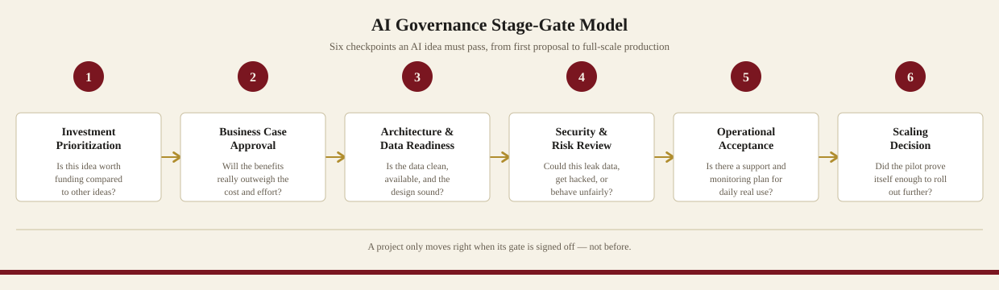

# AI Governance Stage-Gate Framework

A simple, six-gate governance model for taking an AI idea from "someone had a good idea" to "it's safely running in production" — designed and used by [Imran Sheikh](https://linkedin.com/in/imranazhar) while leading Data, AI & Enterprise Technology at a large UAE media and communications organization.



## Why this exists

Most organizations either over-govern AI (a single giant sign-off that slows everything down) or under-govern it (no checks at all until something goes wrong). This framework splits governance into six lightweight checkpoints spread across the life of a project, so risk is caught early and cheaply — while low-risk ideas can still move fast.

**Read the full explanation:** [`docs/framework.md`](docs/framework.md) — what each gate checks, who's accountable, and why AI specifically needs this.

**Use it on your own project:** [`templates/stage-gate-checklist-template.md`](templates/stage-gate-checklist-template.md) — a copy-paste checklist for all six gates.

## The six gates, at a glance

| # | Gate | Question it answers |
|---|---|---|
| 1 | Investment Prioritization | Is this idea worth funding compared to other ideas? |
| 2 | Business Case Approval | Will the benefits really outweigh the cost and effort? |
| 3 | Architecture & Data Readiness | Do we have the right data and technical foundation? |
| 4 | Security & Risk Review | Could this leak data, get hacked, or behave unfairly? |
| 5 | Operational Acceptance | Is there a support and monitoring plan for daily real use? |
| 6 | Scaling Decision | Did the pilot prove itself enough to roll out further? |

## Repo contents

```
ai-governance-stage-gate-framework/
├── README.md                                  ← you are here
├── docs/
│   ├── framework.md                            ← full explanation of every gate
│   └── gate-diagram.svg                        ← the visual model
└── templates/
    └── stage-gate-checklist-template.md        ← reusable checklist for any project
```

## About

This framework reflects governance practices I designed and chaired for enterprise AI product delivery — covering Generative AI, RAG, and AI agent solutions — in a regulated communications environment. Details here are generalized for public sharing.

[LinkedIn](https://linkedin.com/in/imranazhar) · [imranazharsheikh@gmail.com](mailto:imranazharsheikh@gmail.com)
